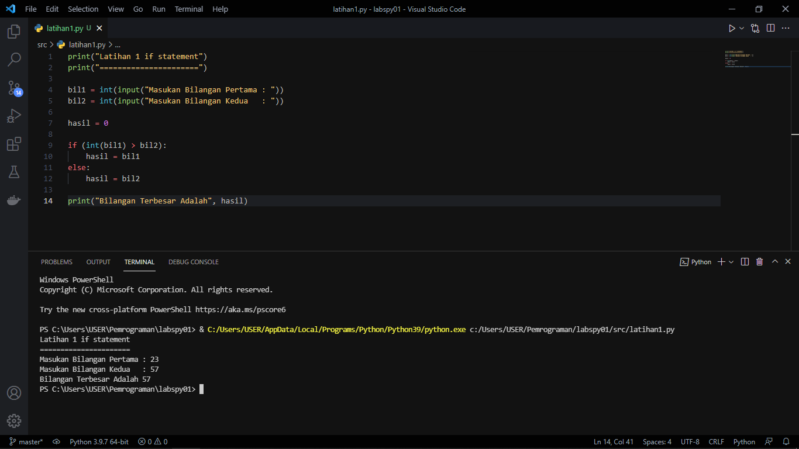
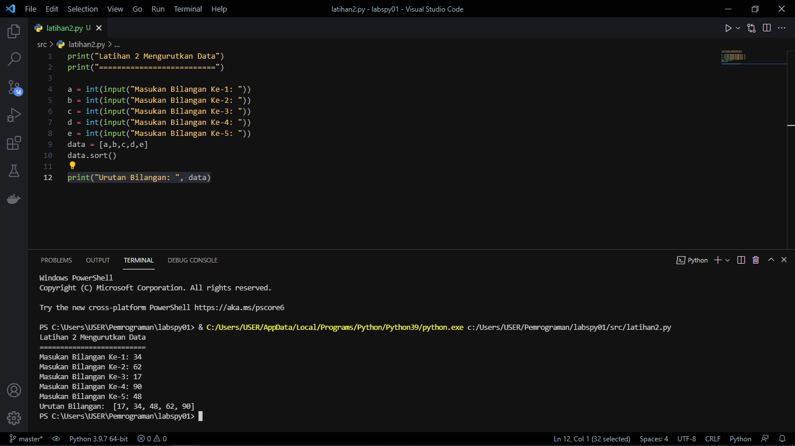
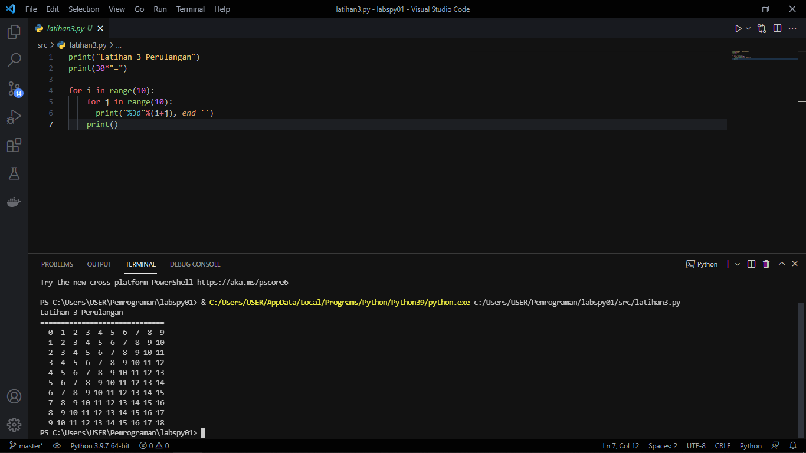
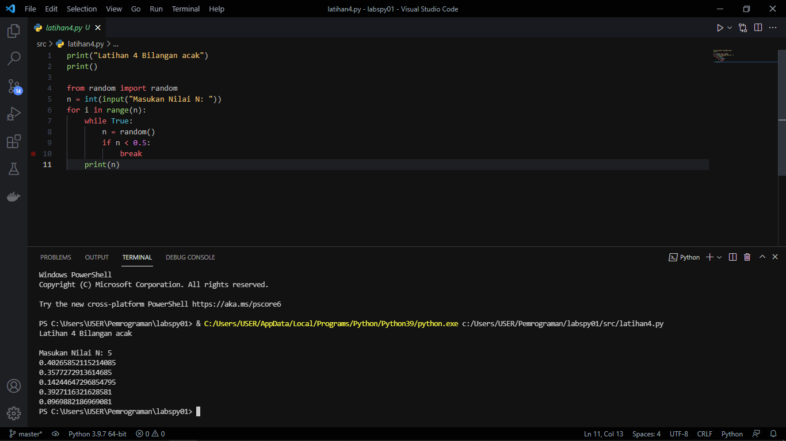

# Labspy01
## Daftar isi
- [Latihan 1](https://github.com/kyuurazz/labspy01/#latihan1)
- [Latihan 2](https://github.com/kyuurazz/labspy01/#latihan2)
- [Latihan 3](https://github.com/kyuurazz/labspy01/#latihan3)
- [Latihan 4](https://github.com/kyuurazz/labspy01/#latihan4)
# Latihan 1
Program Sederhana Menampilkan Bilangan Terbesar



Penjelasan:

1. Untuk menginput dua variabel dengan bilangan bulat (Integer) yang akan diproses dan dimasukan kedalam variabel `hasil`
```bash
bil1 = int(input("Masukan Bilangan Pertama : "))
bil2 = int(input("Masukan Bilangan Kedua   : "))

hasil = 0
```
Proses: 

2. Jika (if) bilangan pertama lebih besar dari bilangan kedua maka hasilnya adalah Bilangan pertama lebih besar
```bash
if (int(bil1) > bil2):
    hasil = bil1
```
3. Tetapi jika bilangan kedua lebih besar dari bilangan pertama maka hasilnya adalah bilangan kedua lebih besar (else)
```bash
else:
    hasil = bil2
```
4. Untuk menampilkan hasil dari dua buah bilangan yang sudah diproses diatas
```bash
print("Bilangan Terbesar Adalah", hasil)
```

# Latihan 2
Program Mengurutkan Data dari Bilangan Terkecil



Penjelasan:

1. Untuk menginput lima buah bilangan yang akan dimasukan ke list variabel `data`
```bash
a = int(input("Masukan Bilangan Ke-1: "))
b = int(input("Masukan Bilangan Ke-2: "))
c = int(input("Masukan Bilangan Ke-3: "))
d = int(input("Masukan Bilangan Ke-4: "))
e = int(input("Masukan Bilangan Ke-5: "))
data = [a,b,c,d,e]
```
2. Data akan diproses menggunakan metode sort. yaitu metode untuk mengurutkan data, baik itu dari nilai terkecil ataupun terbesar.
```bash
data.sort()
```
3. Menampilkan urutan data dari nilai terkecil
```bash
print("Urutan Bilangan: ", data)
```

# Latihan 3
Program Perulangan Bertingkat (Nested for)



Penjelasan: i (baris) j (kolom)

1. Untuk melakukan perulangan baris dan kolom dengan nilai 10, menggunakan `nested for`
```bash
for i in range(10):
    for j in range(10):
```
2. Untuk menampikan hasil dari perulangan
   * Agar terlihat lebih rapih, gunakan `format string` rata ke kanan sebanyak 3 karakter
   * Agar tidak membuat baris baru menggunakan `end=''` (i/baris)
   * Penggunaan `print()` untuk membuat baris baru (j/kolom)
```bash
    print("%3d"%(i+j), end='')
print()
```

# Latihan 4
Program Menampilkan N Bilangan Acak yang Lebih Kecil dari 0.5



Penjelasan: 

1. Import module random untuk membuat bilangan acak
```bash
from random import random
```
2. Untuk menginput nilai yang ingin dikonversikan kedalam bilangan bulat (Integer) yang akan di masukan kedalam variabel `n`
```bash
n = int(input("Masukan Nilai N: "))
```
3. Untuk pengulangan range yang diinputkan oleh variable `n`
```bash
for i in range(n):
    while True:
        n = random()
        if n < 0.5:
```
4. Menampilkan hasil dari `n`
```bash
print(n)
```